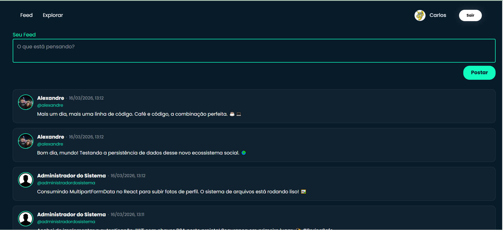
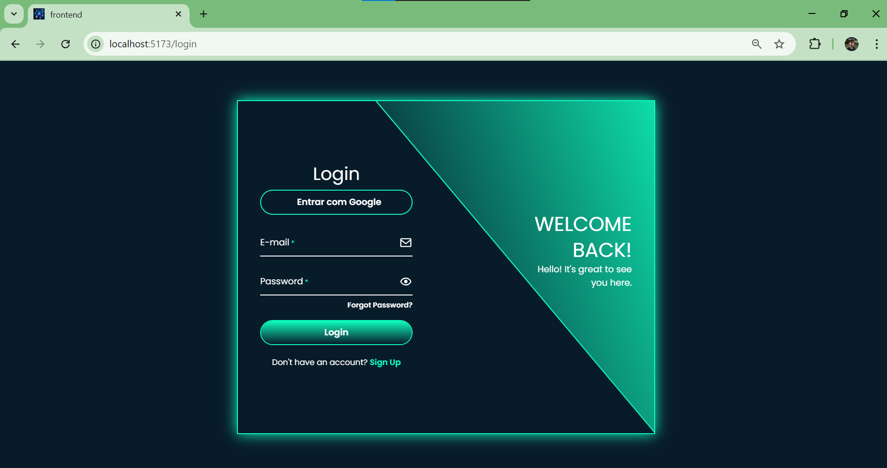
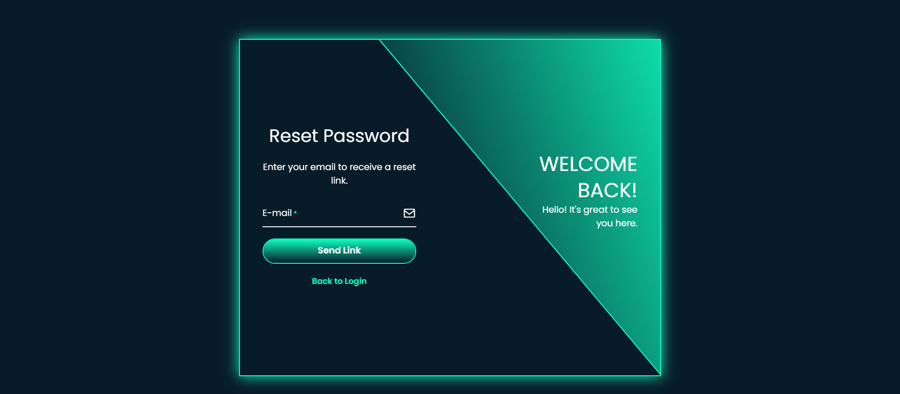
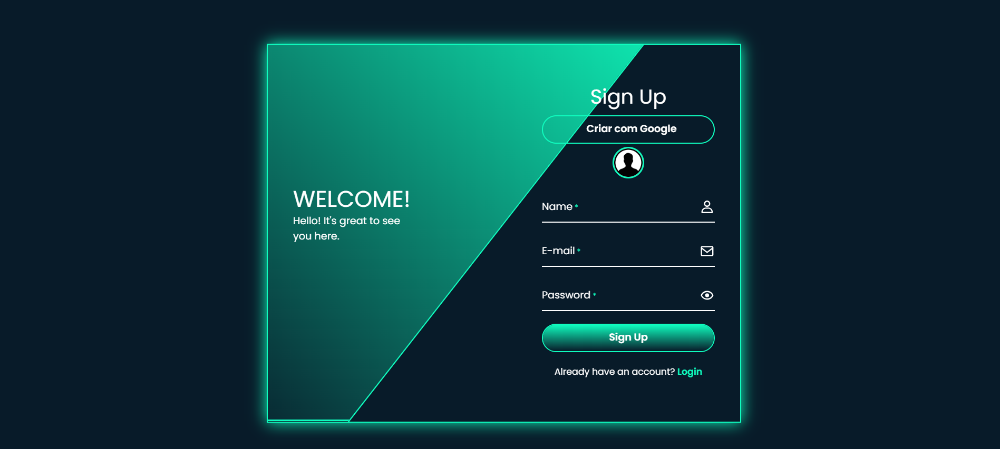

# 🔐 Spring Security Hub - JWT & OAuth2 Google

<div align="center">

 ### 🛡️ Backend
      
 
### 🗄️ Infraestrutura & Segurança
    

### 💻 Frontend
     

### ⚙️ Ferramentas
      
</div>

## 📌 Sobre o Projeto
Este é um ecossistema de segurança avançado desenvolvido com as versões mais recentes do Spring Boot (4.0.2) e Java 21. O projeto implementa uma solução de identidade híbrida, permitindo que os utilizadores se autentiquem via credenciais tradicionais (E-mail/Senha) ou através do Login Social com Google (OAuth2/OIDC).

A arquitetura é totalmente Stateless, utilizando tokens JWT assinados com chaves RSA (Pública/Privada) para garantir a integridade e escalabilidade da API.

> :construction: Projeto em construção :construction:
<p align="center"></p>

## 📱 Interface do Usuário

| Feed Principal | Fluxo de Autenticação |
|---|---|
|  |  |
| **Recuperação de Senha** | **Gestão de Perfil** |
|  |  |

## 🚀 Funcionalidades Implementadas
**Login Híbrido**: Integração completa com Google OAuth2 e autenticação local com BCrypt. 

**Auto-Provisionamento**: Criação automática de perfil de utilizador e vinculação de permissões após o login social.

**Segurança com Spring Security 7**: Uso extensivo de Lambda DSLs para configurações de filtros e autorização.

**RBAC (Role-Based Access Control)**: Hierarquia de permissões (ADMIN vs BASIC) protegendo endpoints específicos.

**Observabilidade**: Sistema de logs detalhados (SLF4J) para monitorização do fluxo de autenticação.

**Persistência Segura**: Gestão de base de dados MySQL integrada via Spring Data JPA.

**Sistema de Micro-blogging (Tweets)**: Criação e visualização de conteúdo em tempo real integrado ao sistema de permissões.

## 🏗️ Arquitetura de Autenticação
## 🛠️ Stack Tecnológica

Linguagem: Java 21 (LTS)

Framework: Spring Boot 4.0.2 / Spring Security 7

Token: Nimbus JOSE + JWT (Assinatura RSA 256)

Base de Dados: MySQL 8.0

Segurança de Password: BCryptPasswordEncoder

Ferramentas: Docker, Maven, Google Cloud Console

## 🏗️ Arquitetura de Segurança
O fluxo de segurança foi desenhado para ser resiliente:

OAuth2SuccessHandler: Intercepta o sucesso do Google, persiste o utilizador e gera o redirecionamento com o JWT.

RSA Keys: Utilização de par de chaves assimétricas para assinatura de tokens.

CORS: Configurado para permitir integrações seguras com frontends modernos (React/Next.js).

## 📋 Endpoints Principais

| Método | Endpoint                             | Descrição                                   | Acesso            |
|--------|--------------------------------------|---------------------------------------------|-------------------|
| POST   | /login                               | Autenticação local (retorna JWT)            | Público           |
| GET    | /oauth2/authorization/google         | Inicia o fluxo de login com Google          | Público           |
| POST   | /users                               | Registo de novos utilizadores               | Público           |
| PUT    | /users/{id}                          | Atualização de nome e foto de user          | Autenticado       |
| GET    | /feed                                | Visualização de tweets                      | Público           |
| POST   | /tweets                              | Criação de novo tweet                       | Autenticado       |
| DELETE | /tweets/{id}                         | Excluir tweet                               | Autenticado/Admin |

## 🧩 Como testar o projeto

### ⚙️ Configuração do Ambiente
Para manter a segurança, o projeto utiliza Variáveis de Ambiente.

1. Crie um ficheiro .env na raiz do projeto:
```bash
GOOGLE_CLIENT_ID=seu_id_aqui
GOOGLE_CLIENT_SECRET=seu_secret_aqui
DB_USERNAME=seu_usuario
DB_PASSWORD=sua_senha
```

2. Certifique-se de ter as chaves ```bash app.pub``` e ```bash app.key``` na pasta ```bashsrc/main/resources```.
 
3. Clone o repositorio
```bash
git clone https://github.com/alexandrecarloss/spring-security.git
```
```bash
cd spring-security
```

4. Iniciar o banco
Em: `spring-security\backend\docker`
```bash
docker-compose up
```

5. Rodar Backend com intelliJ

A API estará disponível em: `http://localhost:8080`

### 4. Frontend

Abra em um terminal:

```bash
cd frontend
npm install
npm run dev
```

Frontend: `http://localhost:5173/`

## 📖 Documentação de API (Swagger)

A documentação estará disponível via Swagger UI depois de iniciar o backend: 

🔗 http://localhost:8080/swagger-ui/index.html

## License

[MIT](https://choosealicense.com/licenses/mit/)


## 👤 Author

[@Carlos Alexandre](https://github.com/alexandrecarloss)

## 🤝 Contributing

Contributions are welcome! Please feel free to submit a Pull Request.

## 📞 Support

For support, open an issue on GitHub.
